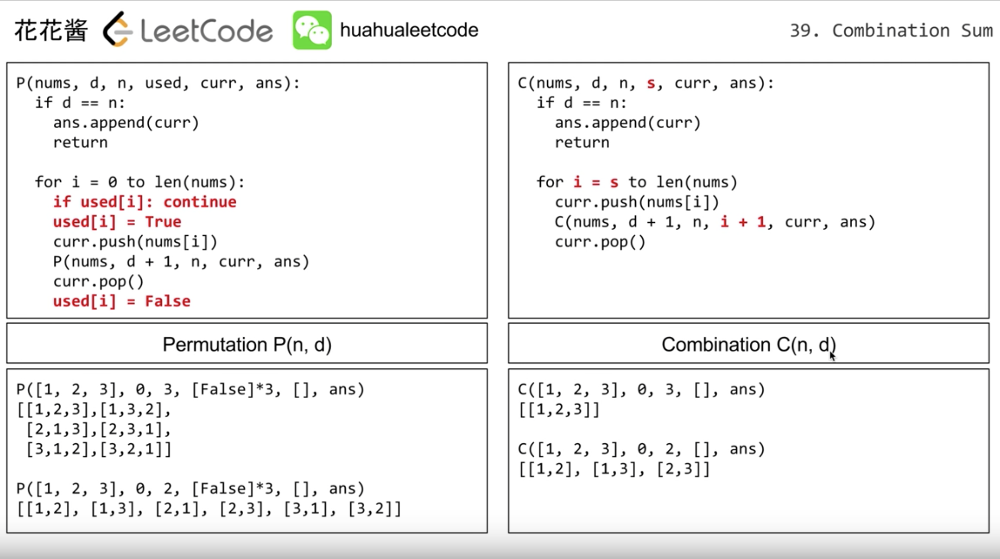
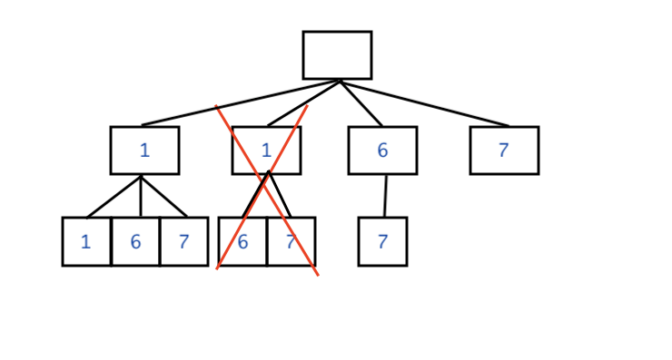

# DFS - Permutation & Combination

The concept of Permutation & Combination is DFS, more details can see [this video](https://www.youtube.com/watch?v=zIY2BWdsbFs) at 3:00.



See the picture above, the difference of Permutation and Combination is that in Permutation we need to loop every possible solution but **store the item that we already used**, however in Combination we add a **start index** which avoid generating the same stuff in different order(do not need to store the used item anymore).


### Permutation Example: not exactly same as HuaHua

```python
def permutation(items, depth, used, curr, ans):
    """
    :param depth: the total depth we want.
    """
    if len(curr) == depth:
        ans.append(curr[:])
    else:
        for i, item in enumerate(items):
            if used[i]:
                continue
            used[i] = True
            curr.append(item)
            permutation(items, depth, used, curr, ans)
            curr.pop()
            used[i] = False
    return ans

# used = [False] * 3
# items = [1, 2, 3]
# ans = permutation(items, 3, used, [], [])
# print(ans)
# [[1, 2, 3], [1, 3, 2], [2, 1, 3], [2, 3, 1], [3, 1, 2], [3, 2, 1]]
```

If there are duplicate items in permutation, like [47. Permutations II](47.&#32;Permutations&#32;II.md),

Adding this line: `if (i > 0 and nums[i] == nums[i - 1] and not used[i - 1]) continue;`.

### Combination

```python
def combination(items, depth, start_index, curr, ans):
    if len(curr) == depth:
        ans.append(curr[:])
    else:
        for i in range(start_index, len(items)):
            curr.append(items[i])
            combination(items, depth, i + 1, curr, ans)
            curr.pop()
    return ans

# items = [1, 2, 3, 4, 5]
# ans = combination(items, 3, 0, [], [])
# print(ans)
# [[1, 2, 3], [1, 2, 4], [1, 2, 5], [1, 3, 4], [1, 3, 5], [1, 4, 5], [2, 3, 4], [2, 3, 5], [2, 4, 5], [3, 4, 5]]
```

If there are duplicate items in combination, like [40. Combination Sum II](40.&#32;Combination&#32;Sum&#32;II.md),

Adding line: `if (i > start_index and item == candidates[i - 1]): continue`.

There is a pic which can help you understand:



